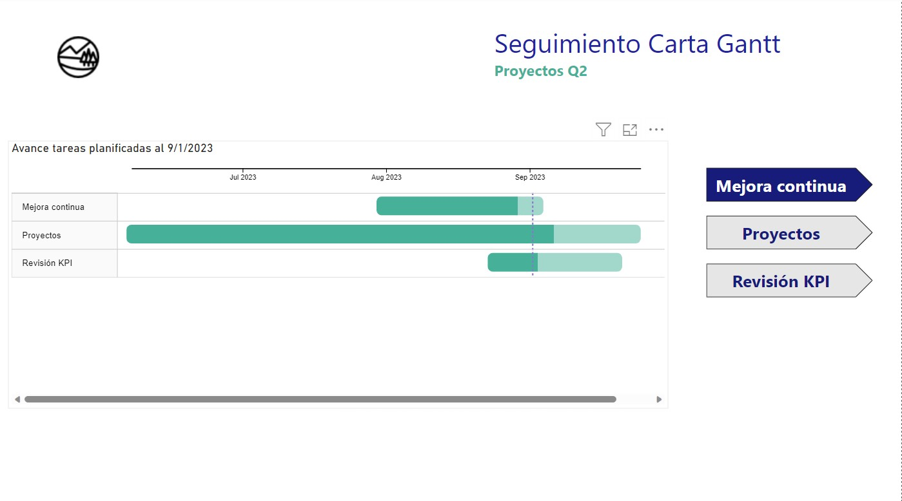

# Seguimiento de planes de trabajo en Power BI

Para el éxito de un proyecto es necesaria la planificación, y consiste en definir tareas, tiempos de ejecución, responsables; hacer seguimiento a esta planificación para encontrar posibles brechas, y así tomar acciones en caso de retrasos no planificados.

El uso de cartas Gantt es el método más eficaz en planificación de proyectos y MS project es el software más usado para ello. Aquí se propone una alternativa, usando MS Excel como fuente de datos y una maqueta de visualización en Power BI para el seguimiento de las acciones planificadas.

### Uso de Power BI como visualizador de reportabilidad

Una de esas ventajas de Power Bi es la facilidad en desarrollar visualizaciones de alto nivel, su aplicación online SaaS (Software as a Service) que ofrece una difusión efectiva a los diversos miembros de trabajo u organización.

### Objetivos
Este repositorio tiene como objetivo las siguientes acciones:

- Contrucción de carta Gantt para planificación de trabajo
- Construir una visualización en Power Bi para el seguimiento de la planificación

### Planificación de tareas

Para comenzar, se diseña el formato de planificación de un proyecto en Excel con los campos necesarios para su confección, como muestra la figura.

En este caso, tenemos los siguientes campos:

- Tarea: Propósitos definidos en el proyecto.
- Subtareas: Son las actividades que forman parte de la tarea.
- Fecha Inicio: Fecha de inicio planificada de la subtarea
- Fecha Termino: Fecha de termino planificada de la subtarea
- Responsable: Fecha de inicio planificada de la subtarea
- % real: Porcentaje de avance real de la subtarea.
- Estado: Estado de la subtarea (En curso, Completada, Atrasada)
- Comentario: Comentarios adicionales que aportan valor en el seguimiento de las subtareas.

### Calculo de avance planificado de subtareas

Hay diversas formas de calcular el porcentaje de avance planificado, en particular se va a utilizar el cálculo por días laborales.

Para calcular el porcentaje de avance de la subtarea es necesario su fecha de inicio, fecha de término, y la fecha de evaluación del proyecto, siendo en este caso es el <b>01 de Septiembre de 2023</b>.

Tenemos 3 escenarios:

1. Fecha de evaluación menor a la fecha de inicio.

    En este escenario la subtarea aún no se inicia , por lo tanto su porcentaje de avance es 0, como se señala en la figura.  

    

2. Fecha de evaluación entre la fecha de inicio y término.

    En este escenario, se deben calcular la proporción entre la cantidad de días laborales entre la fecha de inicio y la fecha de evaluación y la cantidad de días laborales de la subtarea, como muestra la figura.  

    

3. Fecha de evaluación mayor a la fecha de término.

    En este escenario la subtarea ya tuvo que ejecutarse completamente , por lo tanto su porcentaje de avance es 100, como se exhibe en la figura.  

    

La visulización en Power BI considera días laborales aquellos no feriados que son entre Lunes y Viernes. Se debe ingresar el listado de días feriados en el archivo, como muestra la figura, los feriados de Chile para el año 2023.

### Visualización de Subtareas

Aprovechando las propiedades de Power BI, se desarrolló una vista para revisar los estados de las subtareas (Atrasada, Completada, En curso), y por las distintas tareas, mediante el uso de bookmarks.

Al pasar por cada barra de la subtarea, se muestra el detalle de la subtarea, como muestra la figura.

### Medición de avances de las tareas

Ya con la revisión de las subtareas, el último paso es realizar una metodología de cálculo de porcentaje de avance para las tareas, con un mecasnimo de agrupación de las subtareas.
Estas fueron calculadas como medidas en Power BI.

1. <b>Porcentaje de avance planificado</b>
En el caso del avance planificado, se extrae la <b>menor</b> fecha de inicio y la <b>mayor</b> fecha de término de las subtareas asociadas a la tarea, para realizar el mismo cálculo de avance planificado de las subtareas.

2. <b>Porcentaje de avance real</b>
Para calcular el avance real, se realiza un promedio ponderado del porcentaje de avance real de las subtareas, usando como pesos los días laborales de cada subtarea.

El resultado del calculo se plasma en una visualización para segukiento de las tareas, como muestra la figura.

Existen otros métodos de cálculo, que pueden ser calculados usando las potentes propiedades de cálculo de Power BI.